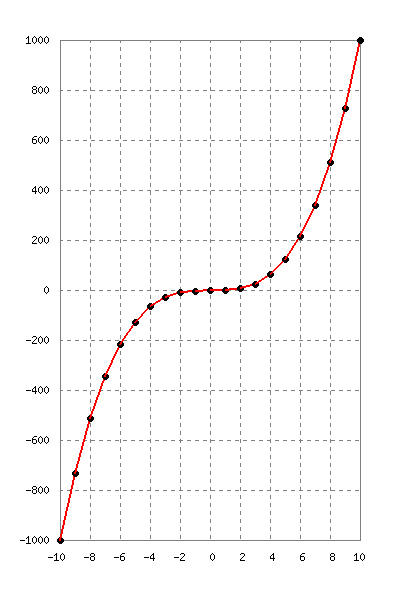

# nim-libgd
Nim Wrapper for [LibGD](https://libgd.github.io/) 2.x

Work in progress...

This library has been tested with Nim v0.20.0 (1.0 RC) on Linux

## Example of Usage

```nim
import libgd

proc main() =

  withGd imageCreate(300, 300) as img:
    discard img.backgroundColor(0xffffff)
    let green = img.setColor(0, 0, 255)

    img.setThickness(4)
    img.drawRectangle(
      startCorner=[10, 10],
      endCorner=[300 - 10, 300 - 10],
      color=green)
    let png_out = open("test.png", fmWrite)
    img.writePng(png_out)
    png_out.close()

main()
```
### Fractal Image from Examples


### Graph from Examples



## How to install nim-libgd with Nimble?

You need to have installed the [gd](https://libgd.github.io/) library in your system.

If you use Arch Linux, the library can be installed with: sudo pacman -S gd.

Run the [Nimble](https://github.com/nim-lang/nimble) install command: $ nimble install https://github.com/mrhdias/nim-libgd

## Functions

Work in progress...

### Drawing Functions

```nim
proc setPixel(
  img: gdImagePtr,
  point: array[2,int],
  color: int = -1
)
proc drawLine(
  img: gdImagePtr,
  start_point: array[2,int],
  end_point: array[2,int],
  color: int = -1,
  dashed: bool = false
)
proc drawRectangle(
  img: gdImagePtr,
  start_corner: array[2,int],
  end_corner: array[2,int],
  color: int,
  fill: bool = false
)
proc drawArc(
  img: gdImagePtr,
  center: array[2,int],
  axis: array[2,int],
  angles: array[2,int],
  color: int,
  fill: bool = false,
  style: int = 0
)
proc drawEllipse(
  img: gdImagePtr,
  center: array[2,int],
  axis: array[2,int],
  color: int,
  fill: bool = false
)
proc drawCircle(
  img: gdImagePtr,
  center: array[2,int],
  radius: int,
  color: int = -1,
  fill: bool = false
)
proc drawPolygon(
  img: gdImagePtr,
  points: openArray[array[0..1, int]],
  color: int,
  fill: bool = false,
  open: bool = false
)
proc drawRegularPolygon(
  img: gdImagePtr,
  center: array[2,int],
  sides: int,
  radius: int,
  start_angle: int = 0,
  color: int,
  fill: bool = false,
  open: bool = false
)
```
### Image Filters

```nim
proc filterContrast(src: gdImagePtr, contrast: float): bool
proc filterBrightness(src: gdImagePtr, brightness: int): bool
proc filterGrayScale(src: gdImagePtr): bool
proc filterNegate(src: gdImagePtr): bool
proc filterEmboss(src: gdImagePtr): bool
proc filterGaussianBlur(src: gdImagePtr): bool
proc filterSmooth(src: gdImagePtr, weight: float): bool
proc filterEdgeDetectQuick(src: gdImagePtr): bool
proc filterSelectiveBlur(src: gdImagePtr): bool
proc filterMeanRemoval(src: gdImagePtr): bool
```
